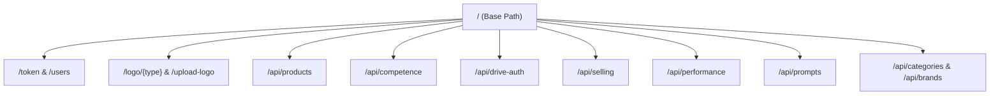

# API Reference

This document maps all the API endpoints, authentication specifications, request payloads, and response structures for the ImportFull Inventory backend service.

---

## 🔒 Authentication

Most endpoints require a JSON Web Token (JWT) provided in the HTTP `Authorization` header as a Bearer token:
```http
Authorization: Bearer <your_jwt_token>
```

---

## 🗺️ Routing Reference Map



---

## 🔑 1. Authentication & Logo Management (`routers/auth.py`)

Handles system access, user profiles, logo streaming, and file uploads.

### POST `/token`
* **Description**: Exchanges user credentials for an access token.
* **Authentication**: None
* **Content-Type**: `application/x-www-form-urlencoded`
* **Request Body**:
  - `username` (string, required)
  - `password` (string, required)
* **Response `200 OK`**:
  ```json
  {
    "access_token": "eyJhbGciOiJIUzI1NiIsIn...",
    "token_type": "bearer"
  }
  ```

### POST `/users/`
* **Description**: Registers a new administrator user.
* **Authentication**: None
* **Request Body**:
  ```json
  {
    "username": "admin",
    "email": "admin@example.com",
    "password": "securepassword"
  }
  ```
* **Response `200 OK`**:
  ```json
  {
    "id": 1,
    "username": "admin",
    "email": "admin@example.com",
    "is_active": true
  }
  ```

### GET `/users/me`
* **Description**: Retrieves credentials of the currently logged-in user.
* **Authentication**: Bearer Token
* **Response `200 OK`**:
  ```json
  {
    "id": 1,
    "username": "admin",
    "email": "admin@example.com",
    "is_active": true
  }
  ```

### PATCH `/users/me`
* **Description**: Modifies username, email, or password for the current active user.
* **Authentication**: Bearer Token
* **Request Body**:
  ```json
  {
    "username": "admin_new",
    "email": "admin_new@example.com",
    "password": "newpassword123"
  }
  ```
* **Response `200 OK`**: Updated user profile payload.

### POST `/upload-logo`
* **Description**: Uploads light, dark, or favicon files to Google Drive, automatically purging old files under the same key.
* **Authentication**: Bearer Token
* **Content-Type**: `multipart/form-data`
* **Form Parameters**:
  - `file`: Binary file upload
  - `logo_type`: String (one of `"light"`, `"dark"`, `"favicon"`)
* **Response `200 OK`**:
  ```json
  {
    "logo_url": "/logo/light",
    "logo_type": "light",
    "drive_file_id": "1A2B3C4D5E6F7G8H9I0J"
  }
  ```

### GET `/logo/{logo_type}`
* **Description**: Publicly proxies logo images from Google Drive. Streams binaries directly and sets cache-control for performance.
* **Authentication**: None
* **URL Parameter**: `logo_type` (path string: `"light"`, `"dark"`, or `"favicon"`)
* **Response `200 OK`**: Image binary payload (`image/png`, `image/jpeg`, etc.).

### GET `/public-settings`
* **Description**: Resolves path mappings for UI displays before authentication is completed.
* **Authentication**: None
* **Response `200 OK`**:
  ```json
  {
    "logo_light_url": "/logo/light",
    "logo_dark_url": "/logo/dark",
    "favicon_url": "/logo/favicon"
  }
  ```

---

## 📦 2. Product Management (`routers/products.py`)

Handles CRUD operations, search filters, spreadsheet ingestion, and external channel synchronization.

### GET `/api/products`
* **Description**: Searches catalog inventory products with advanced pagination and channels.
* **Authentication**: Bearer Token
* **Query Parameters**:
  - `q` (string, optional): Query matching code, brand, name, or description.
  - `category` (string, optional): Filter by category.
  - `brand` (string, optional): Filter by brand.
  - `stock_status` (string, optional): Filter by status (`"all"`, `"without_stock"`, `"low_stock"`).
  - `channel` (string, optional): Filter by channel (`"meli"`, `"tiendanube"`, `"sin_publicar"`, `"todos"`).
  - `sort_by` (string, optional): Column name to sort on.
  - `sort_order` (string, optional): Order direction (`"asc"`, `"desc"`).
  - `page` (int, default: 1): Page offset.
  - `limit` (int, default: 50): Number of results per page.
* **Response `200 OK`**:
  ```json
  {
    "total": 125,
    "items": [
      {
        "id": 10,
        "product_code": "IF-202",
        "product_name": "Inalambrico Pro",
        "brand": "ImportFull",
        "category": "Accesorios",
        "stock": 15,
        "price": 24900.0,
        "price_tienda_nube": 26900.0,
        "meli_id": "MLA123456789",
        "meli_status": "active",
        "tienda_nube_id": "TN987654321",
        "tienda_nube_status": "published",
        "product_image_b_format_url": "https://..."
      }
    ],
    "page": 1,
    "limit": 50
  }
  ```

### GET `/api/products/meli`
* **Description**: Lists products explicitly tied to MercadoLibre. Supports search and sorting.
* **Authentication**: Bearer Token
* **Query Parameters**: Same as `/api/products`, focused on MercadoLibre values.
* **Response `200 OK`**: Includes items containing `meli_id` values, count parameters for active and paused items.

### GET `/api/products/{id}`
* **Description**: Retrieves complete record details for a single product.
* **Authentication**: Bearer Token
* **Response `200 OK`**: A detailed product schema.

### POST `/api/products`
* **Description**: Adds a new product to the catalog.
* **Authentication**: Bearer Token
* **Request Body**: Detailed product creation payload.
* **Response `200 OK`**: Created product schema.

### PUT `/api/products/{id}`
* **Description**: Overwrites product values in the database.
* **Authentication**: Bearer Token
* **Request Body**: Full update payload.
* **Response `200 OK`**: Updated product schema.

### PATCH `/api/products/{id}`
* **Description**: Modifies specific columns (e.g. stock, price) in-place. Triggers webhooks immediately to synchronize connected channels.
* **Authentication**: Bearer Token
* **Request Body**: Partial update payload.
* **Response `200 OK`**: Updated product schema.

### DELETE `/api/products/{id}`
* **Description**: Deletes a product from the database catalog.
* **Authentication**: Bearer Token
* **Response `200 OK`**: `{"status": "deleted"}`

### POST `/api/products/{id}/publish`
* **Description**: Publishes or pauses listings on external channels (MercadoLibre or Tienda Nube).
* **Authentication**: Bearer Token
* **Request Body**:
  ```json
  {
    "action": "publish", 
    "site": "tienda-nube"
  }
  ```
  *(Supported actions: `"publish"`, `"pause"`, `"unpublish"`. Sites: `"meli"`, `"tienda-nube"`)*
* **Response `200 OK`**: Channel synchronization result.

---

## 📊 3. Competitor Analysis & Pricing (`routers/competence.py`)

Handles tracking competitor prices, automated scraping, and local costing templates.

### GET `/api/competence`
* **Description**: Retrieves scraped competitor records alongside internal catalog costing variables.
* **Query Parameters**:
  - `q` (string, optional): Matches competitor title or internal product details.
  - `status` (string, optional): Filters scraper job status (`"pending"`, `"completed"`, `"processing"`, `"error"`).
* **Response `200 OK`**: Competitor pricing matching list.

### POST `/api/competence`
* **Description**: Adds a competitor listing URL to the scraper queue.
* **Request Body**:
  ```json
  {
    "catalog_link": "https://articulo.mercadolibre.com.ar/MLA-..."
  }
  ```
* **Response `200 OK`**: Created queue record.

### PATCH `/api/competence/item`
* **Description**: Updates manual financial coefficients (estimated returns, margins, packaging fees).
* **Query Parameters**:
  - `code` (string, required): Catalog code of the internal product.
* **Request Body**:
  ```json
  {
    "selling_price": 25000.0,
    "product_cost": 12000.0,
    "listing_type": "Premium",
    "ml_commision_percentage": 14.5,
    "estimated_returns_percentage": 0.02,
    "packaging_cost": 250.0,
    "financial_cost": 150.0
  }
  ```
* **Response `200 OK`**: Updated competitor costing database record.

### POST `/api/competence/start-scraping`
* **Description**: Triggers the scraping pipeline to fetch updated prices for all monitored listings.
* **Response `200 OK`**: `{"status": "started", "message": "Global scraping job queued"}`

---

## 🚗 4. Google Drive OAuth Integration (`routers/drive_auth.py`)

Manages Drive credentials, tokens, and folder structures.

### GET `/api/drive-auth/status`
* **Description**: Checks the authorization status of the Google Drive integration.
* **Response `200 OK`**:
  ```json
  {
    "authenticated": true,
    "root_folder_id": "1dd2P6OkaFgvkah-sBr_sjagAnCk31n-v"
  }
  ```

### GET `/api/drive-auth/url`
* **Description**: Generates the Google OAuth authorization URL.
* **Response `200 OK`**: `{"url": "https://accounts.google.com/o/oauth2/v2/auth?..."}`

### GET `/api/drive-auth/callback`
* **Description**: Processes the OAuth callback code, exchanges it for tokens, and stores them.
* **Response `200 OK`**: HTML message confirming successful authentication.

---

## ⚡ 5. Selling Cost Webhook Relay (`routers/selling.py`)

Integrates with an external selling cost calculation webhook to automate MercadoLibre fee updates.

### GET `/api/selling/by-code/{product_code}`
* **Description**: Returns calculated selling costs for a product.
* **Response `200 OK`**: Detailed Selling Calculation object.

### POST `/api/selling/by-code/{product_code}/calculate`
* **Description**: Relays a calculation request to the external webhook.
* **Response `200 OK`**:
  ```json
  {
    "status": "success",
    "message": "Cálculo iniciado. Los datos estarán disponibles en unos segundos."
  }
  ```

---

## 🎯 6. Quality Audits (`routers/performance.py`)

Retrieves listing health assessments and scorecards from MercadoLibre.

### GET `/api/performance/{meli_id}`
* **Description**: Returns quality score details for a specific listing.
* **Response `200 OK`**:
  ```json
  {
    "summary": {
      "meli_id": "MLA123456789",
      "quality_level": "gold",
      "overall_score": 92,
      "level_wording": "Excelente calidad",
      "item_calculated_at": "2026-05-28T14:30:00"
    },
    "rows": [
      {
        "bucket_title": "Ficha Técnica",
        "rule_status": "COMPLETED",
        "wording_title": "Ficha técnica completa",
        "wording_link": null
      },
      {
        "bucket_title": "Imágenes",
        "rule_status": "PENDING",
        "wording_title": "Sube una imagen con fondo blanco puro",
        "wording_link": "https://..."
      }
    ]
  }
  ```

### GET `/api/performance/scores/bulk`
* **Description**: Bulk fetches quality scores for a list of MercadoLibre IDs.
* **Query Parameters**:
  - `meli_ids` (string, required): Comma-separated list of MLA IDs.
* **Response `200 OK`**: List of overview scorecards.

---

## 🤖 7. Prompts Configuration (`routers/prompts.py`)

Manages the default text templates used to generate product content with AI.

### GET `/api/prompts/`
* **Description**: Returns all configured prompts.
* **Response `200 OK`**: List of prompt records.

### PATCH `/api/prompts/{id}`
* **Description**: Updates specific fields of a prompt configuration.
* **Request Body**:
  ```json
  {
    "ai_general": "Eres un asistente experto en SEO...",
    "rules": "- No exceder 60 caracteres\n- Usar mayúsculas al inicio...",
    "ai_improving_human_reply": "Mejora esta respuesta..."
  }
  ```
* **Response `200 OK`**: Updated prompt configuration.
